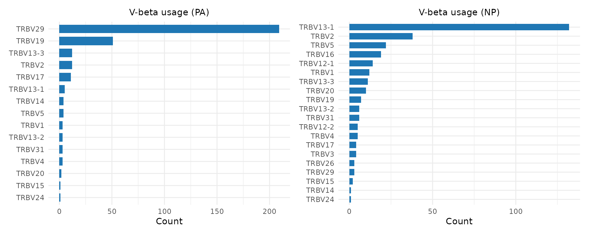
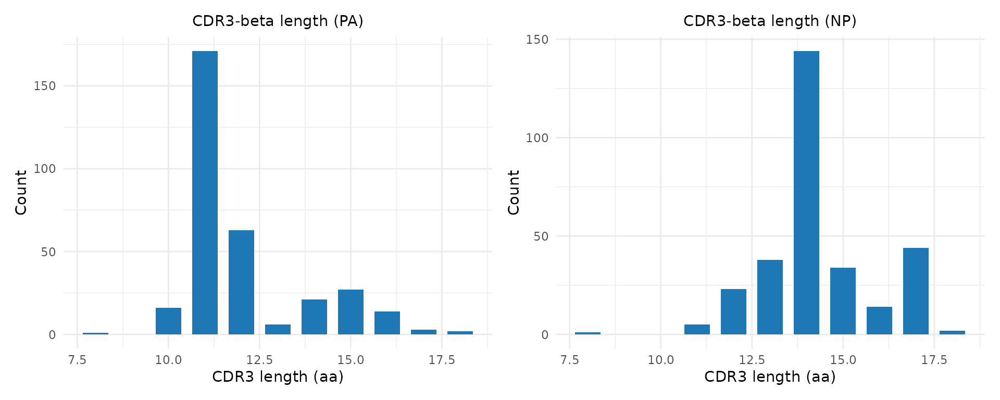
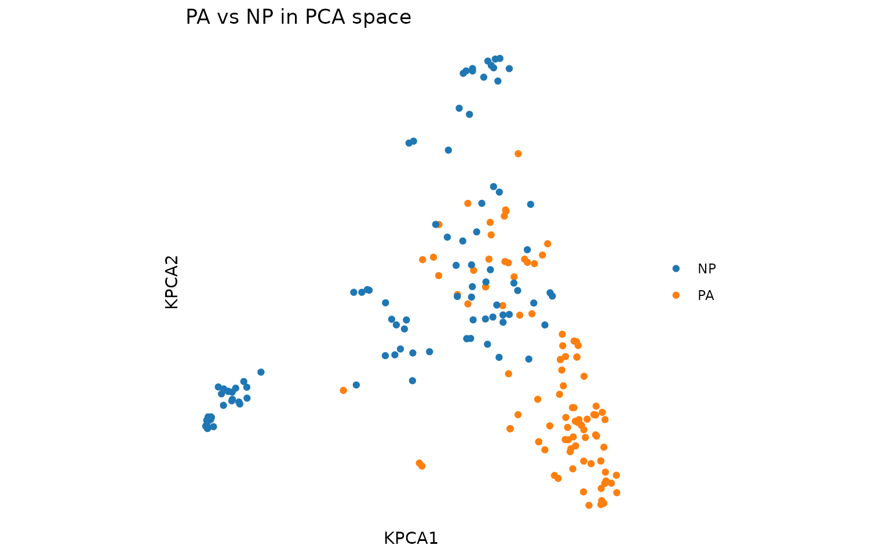
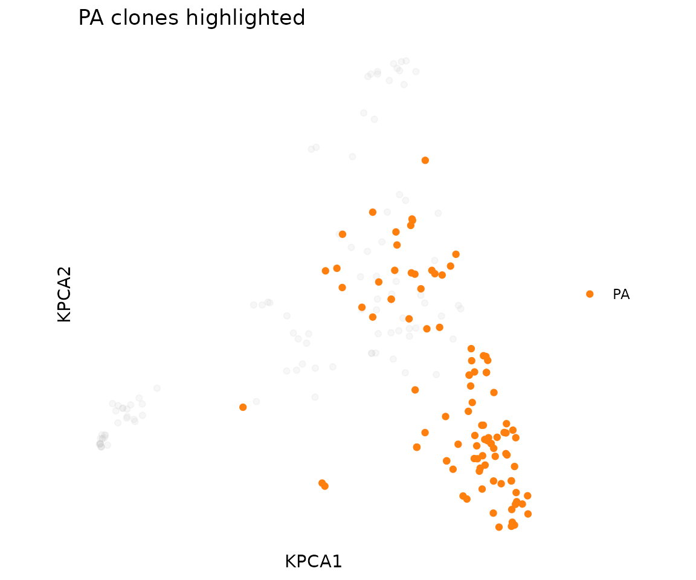

# Comparing TCR Repertoires

## Introduction

Comparing TCR repertoires between conditions is one of the most common
analysis tasks in immunology. Typical questions include:

- Do responders and non-responders share different TCR signatures?
- How does the repertoire change before and after treatment?
- Which epitope-specific responses are more clonally expanded?
- Are there public clonotypes shared across patients?

This vignette demonstrates comparison workflows using the DASH dataset,
where we treat different epitope-specific responses as different
“conditions” to compare.

## Setup

``` r
library(tcrdistR)
data(dash)

# Split into two "conditions" for comparison
pa <- dash[dash$epitope == "PA", ]
np <- dash[dash$epitope == "NP", ]

cat("PA-specific TCRs:", nrow(pa), "\n")
#> PA-specific TCRs: 324
cat("NP-specific TCRs:", nrow(np), "\n")
#> NP-specific TCRs: 305
```

## Repertoire Overlap

**Biological question:** Do two samples share the same clonotypes?

[`tcr_repertoire_overlap()`](https://shihanli92.github.io/tcrdistR/reference/tcr_repertoire_overlap.md)
compares clone sharing between two samples using three complementary
metrics:

- **Jaccard index**: What fraction of unique clonotypes are shared?
  (presence/absence only)
- **Morisita-Horn**: Do the two samples share the same *dominant*
  clonotypes? (abundance-weighted)
- **Overlap coefficient**: What fraction of the *smaller* sample’s
  clonotypes are found in the larger sample?

``` r
# Create named count vectors (names = clonotype identifiers)
pa_counts <- table(pa$cdr3b)
np_counts <- table(np$cdr3b)

ov <- tcr_repertoire_overlap(pa_counts, np_counts)
ov
#> $jaccard
#> [1] 0.002645503
#> 
#> $morisita_horn
#> [1] 0.0004578907
#> 
#> $overlap_coef
#> [1] 0.006711409
```

A Jaccard of 0 means no shared CDR3-beta sequences between PA and NP
responses — these epitopes drive completely distinct TCR populations.
This is expected for well-separated viral epitopes.

### Pairwise overlap across all epitopes

``` r
epitopes <- sort(unique(dash$epitope))
n_ep <- length(epitopes)
jaccard_mat <- matrix(0, n_ep, n_ep, dimnames = list(epitopes, epitopes))

for (i in seq_len(n_ep)) {
    counts_i <- table(dash$cdr3b[dash$epitope == epitopes[i]])
    for (j in seq_len(i)) {
        counts_j <- table(dash$cdr3b[dash$epitope == epitopes[j]])
        ov <- tcr_repertoire_overlap(counts_i, counts_j, metrics = "jaccard")
        jaccard_mat[i, j] <- ov$jaccard
        jaccard_mat[j, i] <- ov$jaccard
    }
}

round(jaccard_mat, 3)
#>         F2  m139   M38   M45    NP    PA   PB1
#> F2   1.000 0.000 0.000 0.000 0.004 0.006 0.002
#> m139 0.000 1.000 0.008 0.004 0.000 0.000 0.005
#> M38  0.000 0.008 1.000 0.020 0.000 0.000 0.010
#> M45  0.000 0.004 0.020 1.000 0.000 0.000 0.008
#> NP   0.004 0.000 0.000 0.000 1.000 0.003 0.015
#> PA   0.006 0.000 0.000 0.000 0.003 1.000 0.004
#> PB1  0.002 0.005 0.010 0.008 0.015 0.004 1.000
```

Epitopes with higher overlap share more CDR3 sequences, which could
indicate cross-reactive TCRs or convergent V-gene usage.

## Comparative Diversity

**Biological question:** Which immune responses are dominated by a few
expanded clones, and which are broadly polyclonal?

A highly clonal response (clonality near 1) suggests strong
antigen-driven expansion of specific T cell clones. A diverse response
(clonality near 0) suggests either a polyclonal response or insufficient
stimulation.

``` r
diversity_table <- do.call(rbind, lapply(epitopes, function(ep) {
    counts <- dash$count[dash$epitope == ep]
    div <- tcr_diversity(counts, order = 2, ci = FALSE)
    data.frame(
        epitope = ep,
        n_clones = tcr_richness(counts),
        clonality = round(tcr_clonality(counts), 3),
        shannon = round(tcr_shannon_entropy(counts), 3),
        simpson = round(div$entropy, 3),
        effective_n = round(div$effective_number, 1),
        gini = round(tcr_gini(counts), 3),
        stringsAsFactors = FALSE
    )
}))

diversity_table
#>   epitope n_clones clonality shannon simpson effective_n  gini
#> 1      F2      117     0.032   4.610   0.994       161.0 0.236
#> 2    m139       87     0.039   4.291   0.991       105.9 0.255
#> 3     M38      158     0.094   4.586   0.983        60.4 0.469
#> 4     M45      291     0.013   5.600   0.999       812.9 0.140
#> 5      NP      305     0.083   5.243   0.991       115.6 0.462
#> 6      PA      324     0.052   5.482   0.996       238.4 0.378
#> 7     PB1      642     0.031   6.267   0.998       654.4 0.265
```

**Interpreting the results:**

- **n_clones** (richness): How many distinct clonotypes were detected.
- **clonality**: 0 = maximally diverse, 1 = single dominant clone.
  Epitopes with high clonality have strong clonal expansions.
- **effective_n**: “How many equally-abundant clonotypes would give this
  diversity?” Lower effective_n relative to n_clones means the
  repertoire is dominated by a few clones.
- **gini**: Inequality in clone sizes. High Gini means a few clones
  dominate; low Gini means clones are evenly distributed.

## Visualizing Repertoire Differences

### Gene usage comparison

**Biological question:** Do different epitope responses use different
V-genes?

``` r
library(ggplot2)
library(patchwork)

p1 <- plot_gene_usage(pa, "vb", title = "V-beta usage (PA)")
p2 <- plot_gene_usage(np, "vb", title = "V-beta usage (NP)")
p1 | p2
```



Differences in V-gene usage between conditions can indicate
germline-encoded contributions to antigen recognition. A V-gene enriched
in one condition may encode CDR1/CDR2 loops that contact the target
MHC-peptide complex.

### CDR3 length distributions

``` r
p1 <- plot_cdr3_length(pa, chain = "beta", title = "CDR3-beta length (PA)")
p2 <- plot_cdr3_length(np, chain = "beta", title = "CDR3-beta length (NP)")
p1 | p2
```



CDR3 length differences can reflect constraints on peptide binding —
some epitopes require longer or shorter CDR3 loops for optimal contact.

### Scatter plots with faceting and highlighting

Visualize the combined repertoire in 2D, colored and faceted by epitope:

``` r
# Combine PA and NP for joint embedding
combined <- rbind(pa[1:100, ], np[1:100, ])
pca <- compute_tcrdist_kernel_pca(combined, "mouse", n_components = 5L)

plot_tcr_scatter(
    pca$embeddings[, 1:2],
    color_by = combined$epitope,
    title = "PA vs NP in PCA space",
    point_size = 1.5
)
```



Highlight one epitope against the background of the full repertoire:

``` r
plot_tcr_scatter(
    pca$embeddings[, 1:2],
    metadata = combined,
    color_by = "epitope",
    highlight = list(epitope = "PA"),
    title = "PA clones highlighted",
    point_size = 1.5
)
```



## Shared Clonotype Identification

**Biological question:** Are there public TCR sequences shared across
multiple individuals?

Public clonotypes — identical or near-identical TCR sequences found in
different people — suggest convergent immune responses driven by common
antigens. These can serve as biomarkers of infection or vaccination.

``` r
# For PA-specific TCRs, count how many subjects share each CDR3-beta
pa_by_subject <- split(pa$cdr3b, pa$subject)
all_cdr3b <- unique(pa$cdr3b)

# Count subjects per clonotype
subject_counts <- sapply(all_cdr3b, function(seq) {
    sum(sapply(pa_by_subject, function(seqs) seq %in% seqs))
})

# Most public clonotypes
public <- sort(subject_counts, decreasing = TRUE)
head(public, 10)
#>  CASSIGGEVFF CASSLDRGEVFF   CASSSYEQYF  CASSFGGEVFF  CASSIGDEQYF CASSPDRGEQYF 
#>            7            5            4            4            4            4 
#> CASSPDRGEVFF  CASSLGGEVFF  CASSWGDEQYF  CASSLGDEQYF 
#>            3            3            3            3

cat("\nClonotypes found in >= 3 subjects:",
    sum(public >= 3), "of", length(public), "\n")
#> 
#> Clonotypes found in >= 3 subjects: 16 of 230
```

For distance-based public motifs (allowing near-matches across
individuals), use
[`find_meta_clonotypes()`](https://shihanli92.github.io/tcrdistR/reference/find_meta_clonotypes.md):

``` r
meta <- find_meta_clonotypes(
    pa, organism = "mouse",
    radius = 48, min_nsubject = 3L,
    subject_col = "subject"
)
cat("Meta-clonotypes shared across >= 3 subjects:", nrow(meta), "\n")
#> Meta-clonotypes shared across >= 3 subjects: 324
if (nrow(meta) > 0) {
    head(meta[, c("cdr3a", "cdr3b", "K_neighbors", "nsubject")])
}
#>              cdr3a             cdr3b K_neighbors nsubject
#> 1    CAVSLDSNYQLIW CASSDFDWGGDAETLYF         324       15
#> 2 CALGDRATGGNNKLTF      CASSPDRGEVFF         324       15
#> 3   CALGSNTGYQNFYF       CASTGGGAPLF         324       15
#> 4    CALAPSNTNKVVF    CASSQDPGDYEQYF         324       15
#> 5    CALVPSNTNKVVF     CASSLGGENTLYF         324       15
#> 6   CALGKNYNQGKLIF       CASDRAGEQYF         324       15
```

## Distance-Based Comparison

**Biological question:** How structurally different are two repertoires
in TCR sequence space?

Use
[`tcrdist_join()`](https://shihanli92.github.io/tcrdistR/reference/tcrdist_join.md)
to find TCRs in one sample that are similar to TCRs in another:

``` r
# Find PA TCRs within distance 100 of NP TCRs
pa_sub <- pa[1:50, ]
np_sub <- np[1:50, ]
cross_matches <- tcrdist_join(pa_sub, np_sub, organism = "mouse",
                              radius = 100, max_n = 3)
cat("Cross-epitope TCR pairs within radius 100:", nrow(cross_matches), "\n")
#> Cross-epitope TCR pairs within radius 100: 0
```

Few or no cross-matches at a tight radius confirms that the two epitope
responses use structurally distinct TCR repertoires.

## Session Info

``` r
sessionInfo()
#> R version 4.6.1 (2026-06-24)
#> Platform: x86_64-pc-linux-gnu
#> Running under: Ubuntu 24.04.4 LTS
#> 
#> Matrix products: default
#> BLAS:   /usr/lib/x86_64-linux-gnu/openblas-pthread/libblas.so.3 
#> LAPACK: /usr/lib/x86_64-linux-gnu/openblas-pthread/libopenblasp-r0.3.26.so;  LAPACK version 3.12.0
#> 
#> locale:
#>  [1] LC_CTYPE=C.UTF-8       LC_NUMERIC=C           LC_TIME=C.UTF-8       
#>  [4] LC_COLLATE=C.UTF-8     LC_MONETARY=C.UTF-8    LC_MESSAGES=C.UTF-8   
#>  [7] LC_PAPER=C.UTF-8       LC_NAME=C              LC_ADDRESS=C          
#> [10] LC_TELEPHONE=C         LC_MEASUREMENT=C.UTF-8 LC_IDENTIFICATION=C   
#> 
#> time zone: UTC
#> tzcode source: system (glibc)
#> 
#> attached base packages:
#> [1] stats     graphics  grDevices utils     datasets  methods   base     
#> 
#> other attached packages:
#> [1] patchwork_1.3.2 ggplot2_4.0.3   tcrdistR_0.1.0 
#> 
#> loaded via a namespace (and not attached):
#>  [1] vctrs_0.7.3        cli_3.6.6          knitr_1.51         rlang_1.3.0       
#>  [5] xfun_0.60          otel_0.2.0         S7_0.2.2           textshaping_1.0.5 
#>  [9] jsonlite_2.0.0     labeling_0.4.3     glue_1.8.1         htmltools_0.5.9   
#> [13] ragg_1.5.2         sass_0.4.10        scales_1.4.0       rmarkdown_2.31    
#> [17] grid_4.6.1         evaluate_1.0.5     jquerylib_0.1.4    fastmap_1.2.0     
#> [21] yaml_2.3.12        lifecycle_1.0.5    compiler_4.6.1     RSpectra_0.16-2   
#> [25] RColorBrewer_1.1-3 fs_2.1.0           Rcpp_1.1.2         lattice_0.22-9    
#> [29] farver_2.1.2       systemfonts_1.3.2  digest_0.6.39      R6_2.6.1          
#> [33] Matrix_1.7-5       bslib_0.12.0       withr_3.0.3        tools_4.6.1       
#> [37] gtable_0.3.6       pkgdown_2.2.1      cachem_1.1.0       desc_1.4.3
```
