# TCRrep Workflow

## Introduction

The `TCRrep` S4 object is the central data structure in tcrdistR. It
holds the clonotype table, organism, distance matrices, and downstream
results in a single object. This vignette walks through a complete
analysis using TCRrep as the backbone.

## Creating a TCRrep

Load the DASH dataset and construct a TCRrep. By default, identical
clones within the same subject are deduplicated and their counts summed:

``` r
library(tcrdistR)
data(dash)

rep <- TCRrep(dash, organism = "mouse", compute_distances = TRUE)
#> deduplicate: 1924 -> 1888 clones
rep
#> TCRrep object: 1888 clonotypes
#>   organism: mouse
#>   chains: AB
#>   metric: tcrdist
#>   distances: paired(dense)
```

The `compute_distances = TRUE` flag computes the full pairwise distance
matrix at construction time and stores it in the `paired_dist` slot:

``` r
dim(rep@paired_dist)
#> [1] 1888 1888
rep@paired_dist[1:5, 1:5]
#>     1   2   3   4   5
#> 1   0 225 194 180 206
#> 2 225   0 201 228 298
#> 3 194 201   0 155 247
#> 4 180 228 155   0 308
#> 5 206 298 247 308   0
```

## Distance Heatmap

With distances already computed, pass the `paired_dist` slot directly to
the heatmap. We use a subset for readability:

``` r
library(ggplot2)

# First 50 clones
idx <- 1:50
plot_tcrdist_heatmap(rep@paired_dist[idx, idx],
                     title = "TCRdist heatmap (first 50 clones)")
```

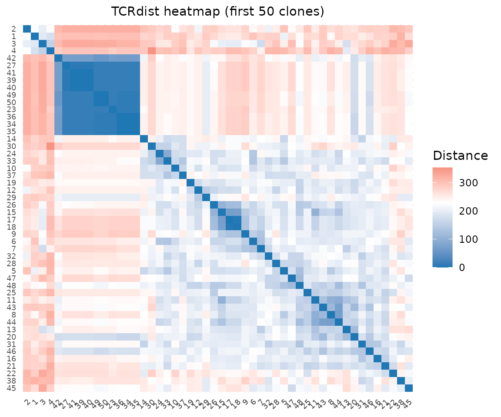

## Distance Distribution

``` r
plot_distance_distribution(rep@paired_dist, title = "Pairwise distance distribution")
```

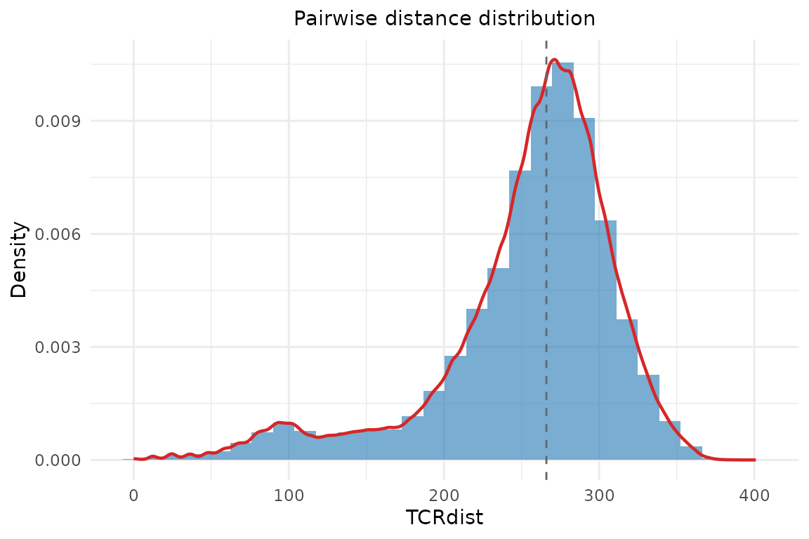

## Gene Usage

Gene usage plots take the clone data.frame and a column name. Access the
clonotype table via `rep@clone_df`:

``` r
plot_gene_usage(rep@clone_df, "va", title = "V-alpha usage")
```

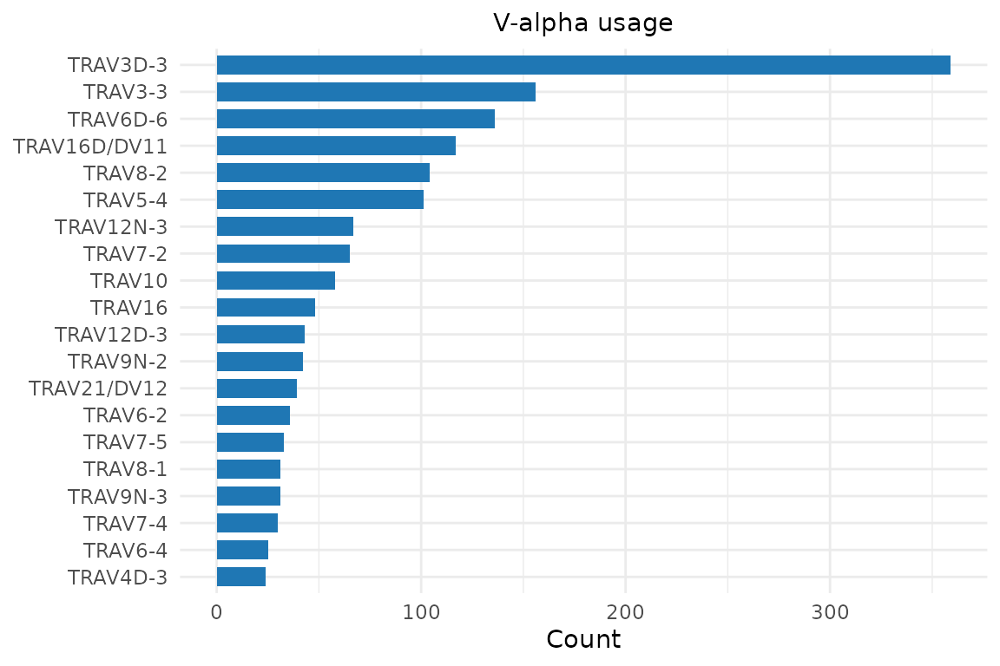

``` r
plot_gene_usage(rep@clone_df, "vb", title = "V-beta usage")
```

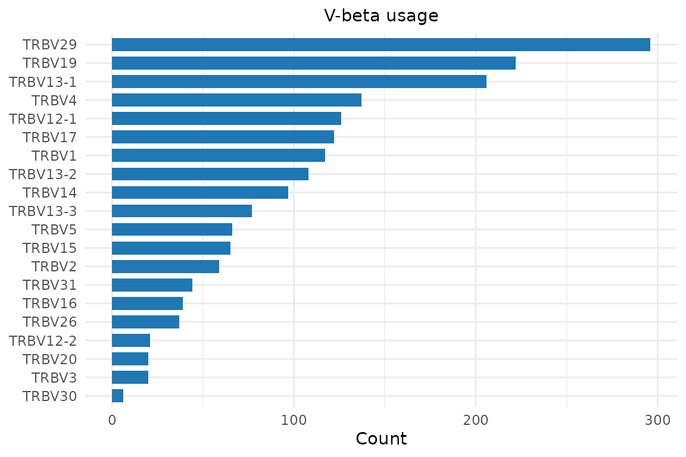

## Dendrogram

The dendrogram function takes a data.frame and organism — extract from
the TCRrep slots. We subsample for a cleaner plot:

``` r
sub_idx <- sample(nrow(rep@clone_df), 100)
plot_tcrdist_dendrogram(
  rep@clone_df[sub_idx, ],
  organism = rep@organism,
  color_by = rep@clone_df$epitope[sub_idx],
  title = "TCR dendrogram colored by epitope"
)
```

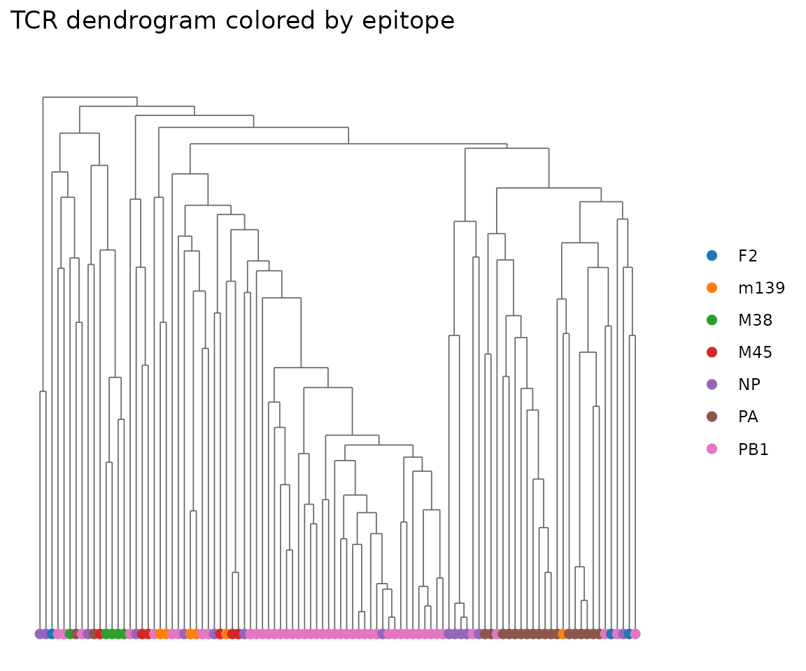

## Kernel PCA and Scatter Plots

Compute a kernel PCA embedding from the TCRrep:

``` r
pca <- compute_tcrdist_kernel_pca(
  rep@clone_df, organism = rep@organism,
  n_components = 50L, method = "eigen"
)
dim(pca$embeddings)
#> [1] 1888   50
```

Visualize the first two components, colored by epitope:

``` r
plot_tcr_scatter(
  pca$embeddings[, 1:2],
  color_by = rep@clone_df$epitope,
  title = "Kernel PCA of DASH TCRs",
  point_size = 1.5
)
```

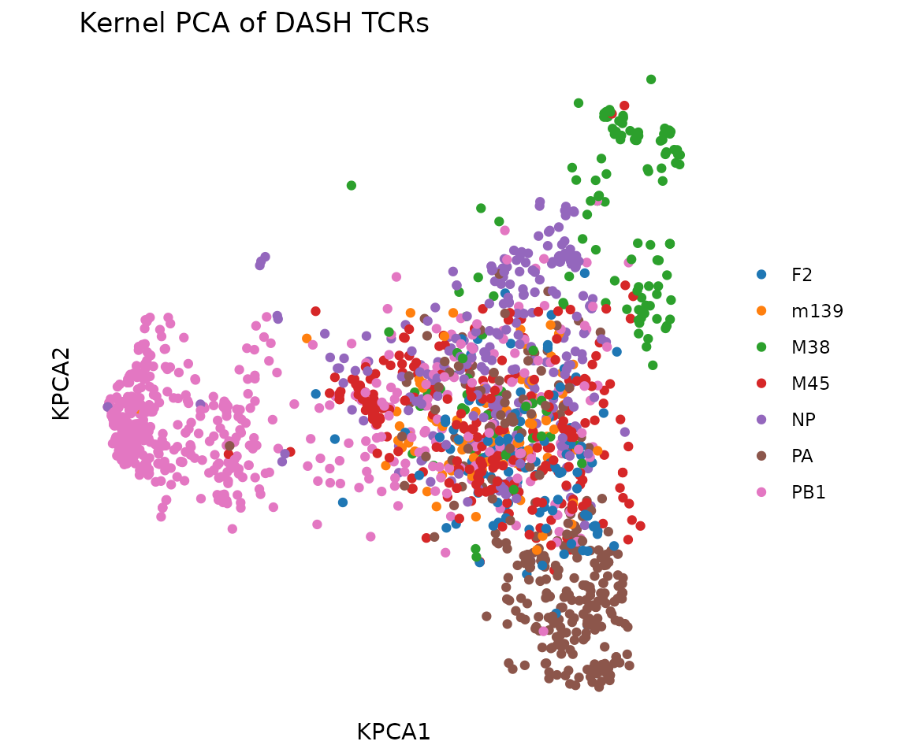

## UMAP

UMAP provides a nonlinear 2D embedding that often separates clusters
better than linear PCA.
[`compute_tcrdist_umap()`](https://shihanli92.github.io/tcrdistR/reference/compute_tcrdist_umap.md)
supports two modes:

- **KNN path** (recommended): pass `tcr_df` + `organism`. Computes
  TCRdist K-nearest-neighbors with chain group masking, builds a fuzzy
  simplicial set graph, and runs UMAP from the precomputed KNN. This
  preserves the TCRdist metric faithfully.
- **PCA path**: pass pre-computed `pca_embeddings`. Runs standard UMAP
  in Euclidean space.

``` r
# KNN path: UMAP directly from TCRdist neighbors
umap <- compute_tcrdist_umap(
  rep@clone_df, organism = rep@organism, seed = 42
)
plot_tcr_scatter(
  umap$embeddings,
  color_by = rep@clone_df$epitope,
  title = "UMAP of DASH TCRs (KNN path)",
  axis_label_prefix = "UMAP",
  point_size = 1.5
)
```

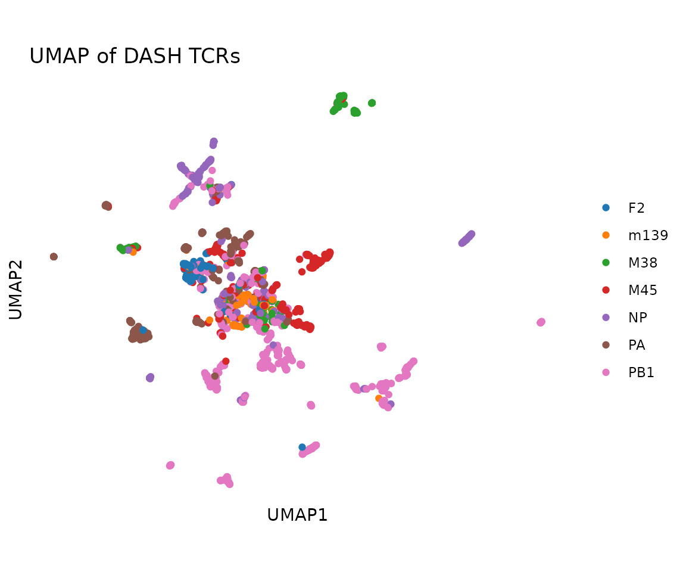

The KNN path also returns the fuzzy simplicial set graph and weighted
nearest-neighbor distances:

``` r
dim(umap$knn_graph)         # N x N sparse matrix
#> [1] 1888 1888
summary(umap$nndists)       # weighted NN distances per clone
#>    Min. 1st Qu.  Median    Mean 3rd Qu.    Max. 
#>    3.90   36.78   74.90   86.89  139.91  220.93
```

Alternatively, use the PCA path for a quicker approximation:

``` r
umap_pca <- compute_tcrdist_umap(pca_embeddings = pca$embeddings, seed = 42)
plot_tcr_scatter(
  umap_pca$embeddings,
  color_by = rep@clone_df$epitope,
  title = "UMAP of DASH TCRs (PCA path)",
  axis_label_prefix = "UMAP",
  point_size = 1.5
)
```

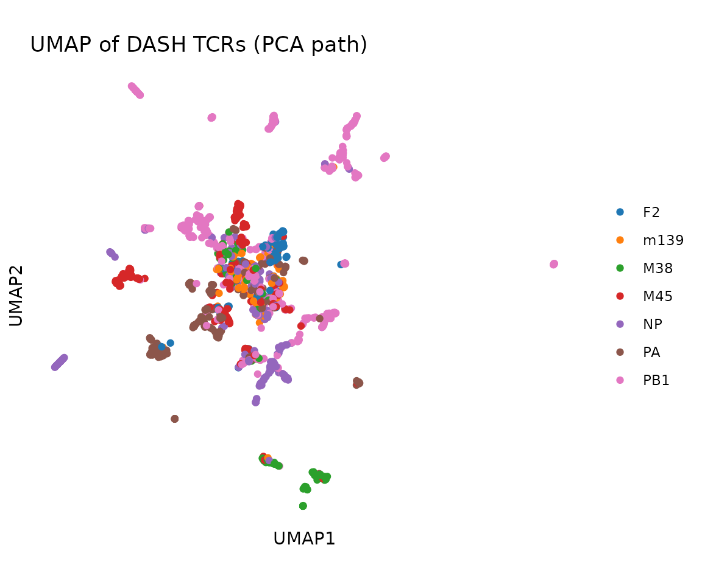

## Single-Chain TCRrep

When working with beta-only data (e.g., from bulk sequencing), create a
TCRrep with `chains = "B"`:

``` r
# Simulate beta-only data
beta_only <- rep@clone_df[1:50, c("vb", "cdr3b", "epitope", "subject", "count")]

rep_beta <- TCRrep(beta_only, organism = "mouse", chains = "B",
                   compute_distances = TRUE)
#> deduplicate: 50 -> 46 clones
rep_beta
#> TCRrep object: 46 clonotypes
#>   organism: mouse
#>   chains: B
#>   metric: tcrdist
#>   distances: paired(dense)
dim(rep_beta@paired_dist)
#> [1] 46 46

# All distance functions work with single-chain data
knn_beta <- tcrdist_knn(beta_only, "mouse", K = 3L)
```

## Clustering

Cluster TCRs and add cluster assignments to the clone table:

``` r
rep@clone_df$cluster <- cluster_tcrs(
  rep@clone_df, organism = rep@organism, k = 7
)
table(rep@clone_df$cluster)
#> 
#>    1    2    3    4    5    6    7 
#> 1685   75  116    6    1    4    1
```

Visualize clusters in PCA space:

``` r
plot_tcr_scatter(
  pca$embeddings[, 1:2],
  color_by = as.factor(rep@clone_df$cluster),
  title = "Clusters in PCA space",
  point_size = 1.5,
  legend_title = "Cluster"
)
```

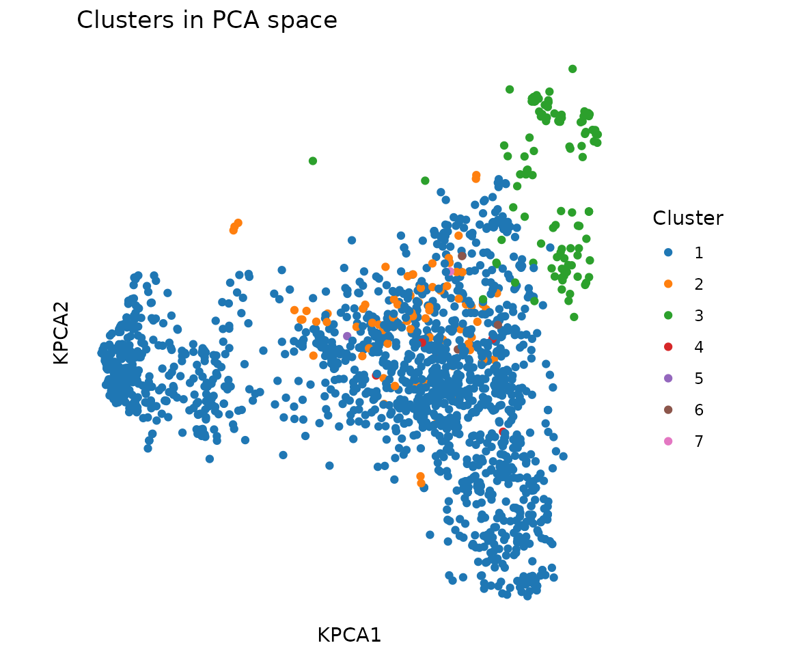

## CDR3 Sequence Logos by Epitope

Extract CDR3 sequences for a specific epitope and plot a logo:

``` r
pa_idx <- rep@clone_df$epitope == "PA"
plot_cdr3_logo(
  rep@clone_df$cdr3b[pa_idx],
  chain = "beta", method = "bits",
  title = "CDR3-beta logo (PA epitope)"
)
#> Warning: `aes_string()` was deprecated in ggplot2 3.0.0.
#> ℹ Please use tidy evaluation idioms with `aes()`.
#> ℹ See also `vignette("ggplot2-in-packages")` for more information.
#> ℹ The deprecated feature was likely used in the ggseqlogo package.
#>   Please report the issue at <https://github.com/omarwagih/ggseqlogo/issues>.
#> This warning is displayed once per session.
#> Call `lifecycle::last_lifecycle_warnings()` to see where this warning was
#> generated.
```

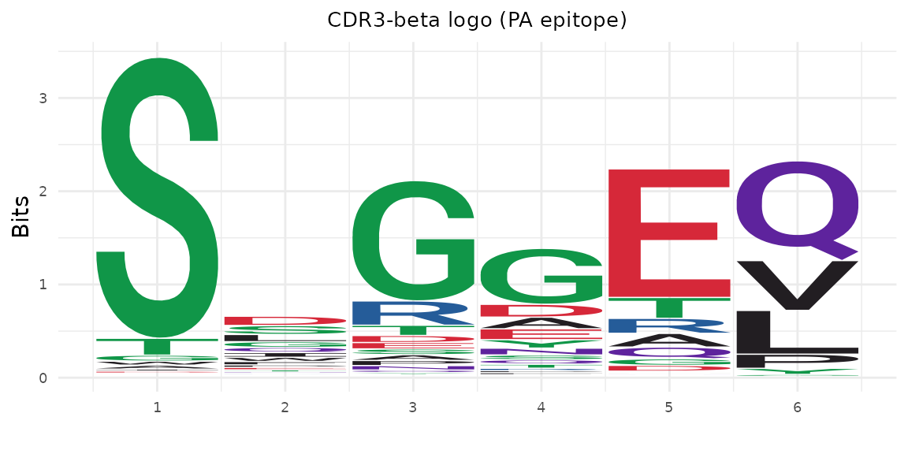

``` r
np_idx <- rep@clone_df$epitope == "NP"
plot_cdr3_logo(
  rep@clone_df$cdr3b[np_idx],
  chain = "beta", method = "bits",
  title = "CDR3-beta logo (NP epitope)"
)
```

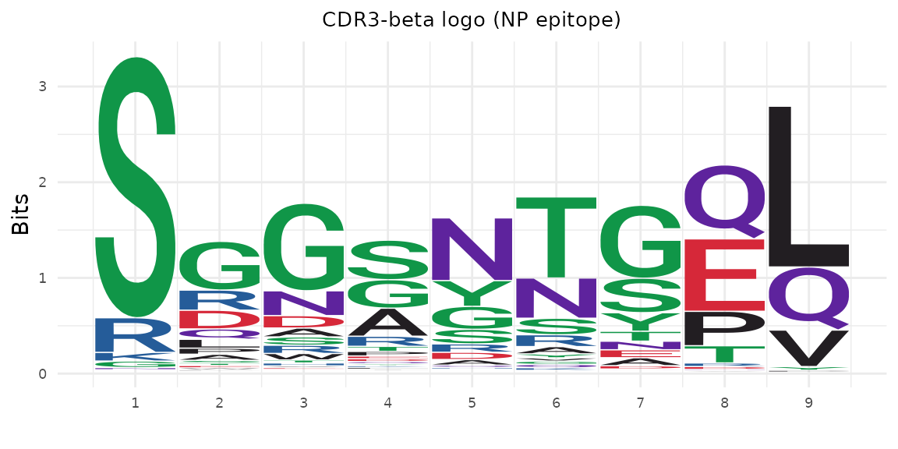

## Neighborhood Test

Test whether epitope labels are enriched in TCR neighborhoods:

``` r
nhood <- neighborhood_test(
  rep@clone_df, organism = rep@organism,
  variable = rep@clone_df$epitope,
  radius = 50, test = "chisq"
)
head(nhood[order(nhood$p_adjusted), c("index", "n_neighbors", "p_value", "p_adjusted")])
#>      index n_neighbors      p_value   p_adjusted
#> 1171  1171          22 2.316573e-42 4.373690e-39
#> 411    411          37 8.751910e-42 5.507869e-39
#> 451    451          37 8.751910e-42 5.507869e-39
#> 305    305          36 1.419724e-40 7.883644e-39
#> 306    306          36 1.419724e-40 7.883644e-39
#> 345    345          36 1.419724e-40 7.883644e-39
```

## Meta-Clonotypes

Find TCR motifs shared across subjects:

``` r
meta <- find_meta_clonotypes(
  rep@clone_df, organism = rep@organism,
  radius = 48, min_nsubject = 2L,
  subject_col = "subject"
)
nrow(meta)
#> [1] 594
head(meta[, c("cdr3a", "cdr3b", "radius", "K_neighbors", "nsubject")])
#>             cdr3a             cdr3b radius K_neighbors nsubject
#> 1    CAADTGNYKYVF     CASSTGDYAEQFF     48           2        2
#> 2 CAASRYGSSGNKLIF CTCSAGTGGYNYAEQFF     48          19        9
#> 3 CAASRYGSSGNKLIF CTCSAGTGGYNYAEQFF     48          19        9
#> 4 CAASRYGSSGNKLIF CTCSAGTGGYNYAEQFF     48          19        9
#> 5    CAASSGSWQLIF   CASSPTGGDQNTLYF     48           2        2
#> 6    CAGSSGSWQLIF   CASSPTGGDQNTLYF     48           2        2
```

Store back into the TCRrep:

``` r
rep@meta_clonotypes <- meta
```

## Diversity

Compute repertoire diversity using the clone counts stored in the
TCRrep:

``` r
div <- tcr_diversity(rep@clone_df$count, order = 2)
div$effective_number
#> [1] 897.1068

tcr_clonality(rep@clone_df$count)
#> [1] 0.04746628
```

## Combined Panel

``` r
library(patchwork)

p1 <- plot_tcrdist_heatmap(rep@paired_dist[1:40, 1:40], title = "Heatmap")
p2 <- plot_distance_distribution(rep@paired_dist, title = "Distribution")
p3 <- plot_tcr_scatter(
  pca$embeddings[, 1:2],
  color_by = rep@clone_df$epitope,
  title = "Kernel PCA", point_size = 1
)
p4 <- plot_gene_usage(rep@clone_df, "vb", title = "V-beta usage")

(p1 | p2) / (p3 | p4) +
  plot_annotation(title = "DASH Repertoire Overview")
```

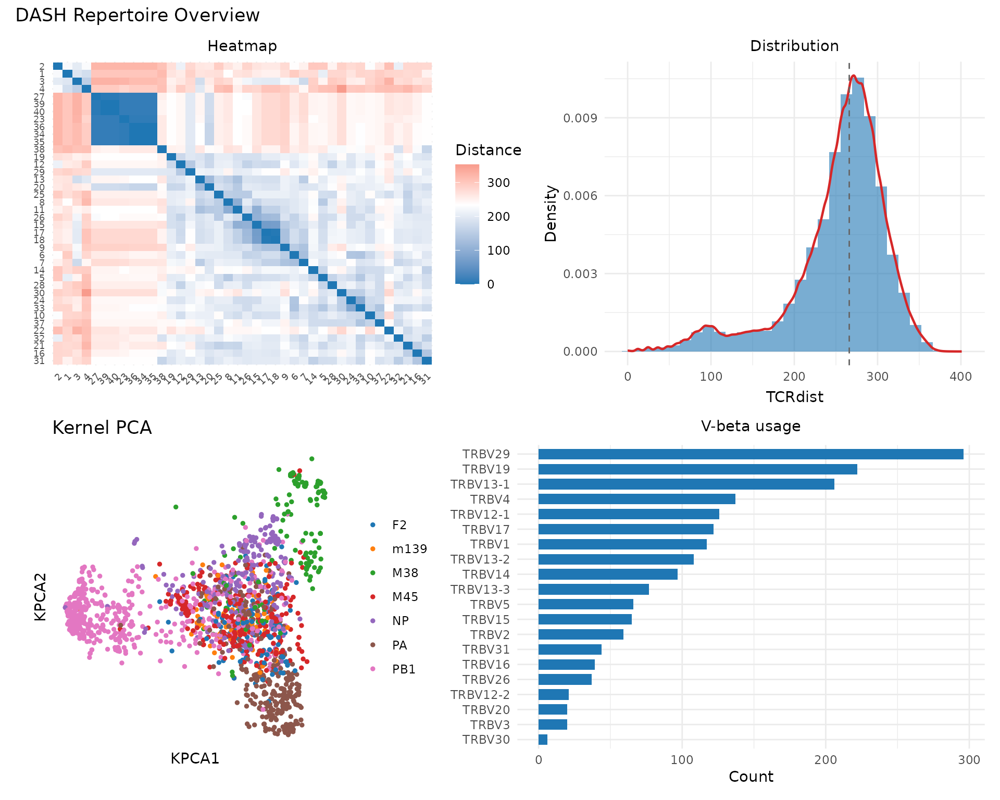
