# Visualization Guide

## Setup

tcrdistR provides plotting functions built on ggplot2. All return ggplot
objects that can be further customized.

``` r
library(tcrdistR)
data(dash)

# Use 100 PA-specific TCRs for fast plots
pa <- dash[dash$epitope == "PA", ]
pa_sub <- pa[1:100, ]
```

## Distance Heatmap

Visualize the pairwise distance matrix as a heatmap. Note that
[`plot_tcrdist_heatmap()`](https://shihanli92.github.io/tcrdistR/reference/plot_tcrdist_heatmap.md)
takes a precomputed distance matrix, not a TCR data.frame:

``` r
library(ggplot2)

dist_mat <- tcrdist_matrix(pa_sub, organism = "mouse")
plot_tcrdist_heatmap(dist_mat)
```

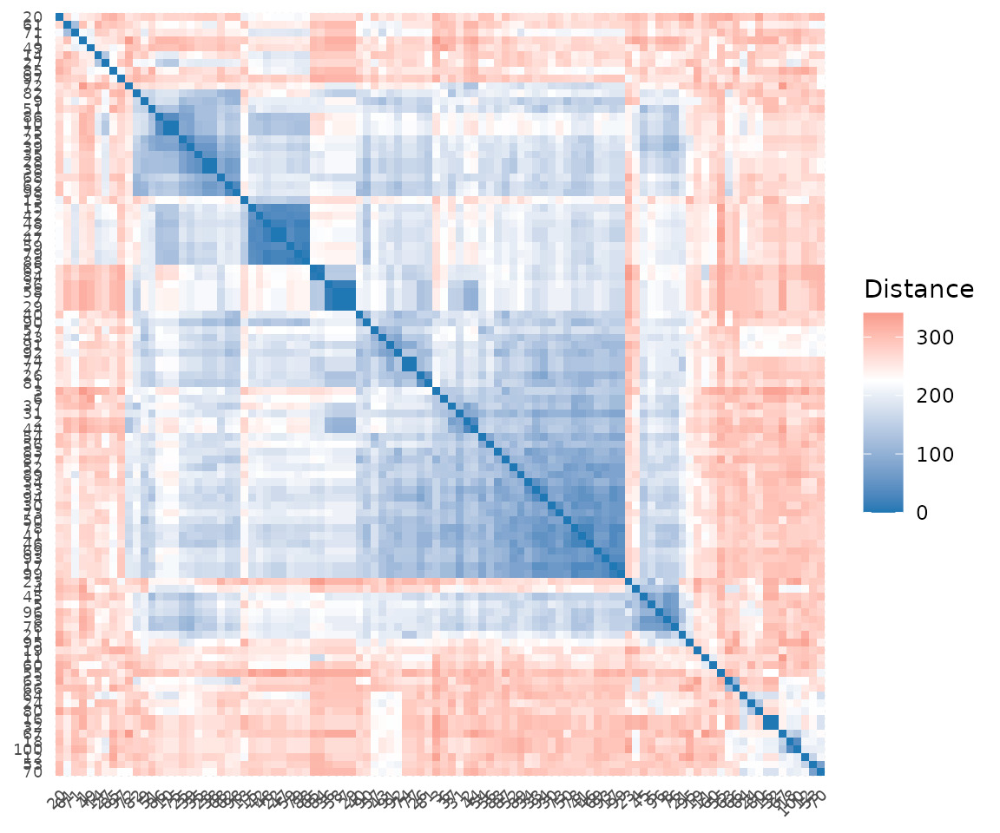

With hierarchical clustering reordering (the default) and custom labels:

``` r
# Use a small subset with unique labels for readability
small_mat <- dist_mat[1:20, 1:20]
plot_tcrdist_heatmap(
  small_mat,
  labels = paste0(pa_sub$cdr3b[1:20], " (", seq_len(20), ")"),
  cluster = TRUE,
  title = "PA-specific TCR Distances"
)
```

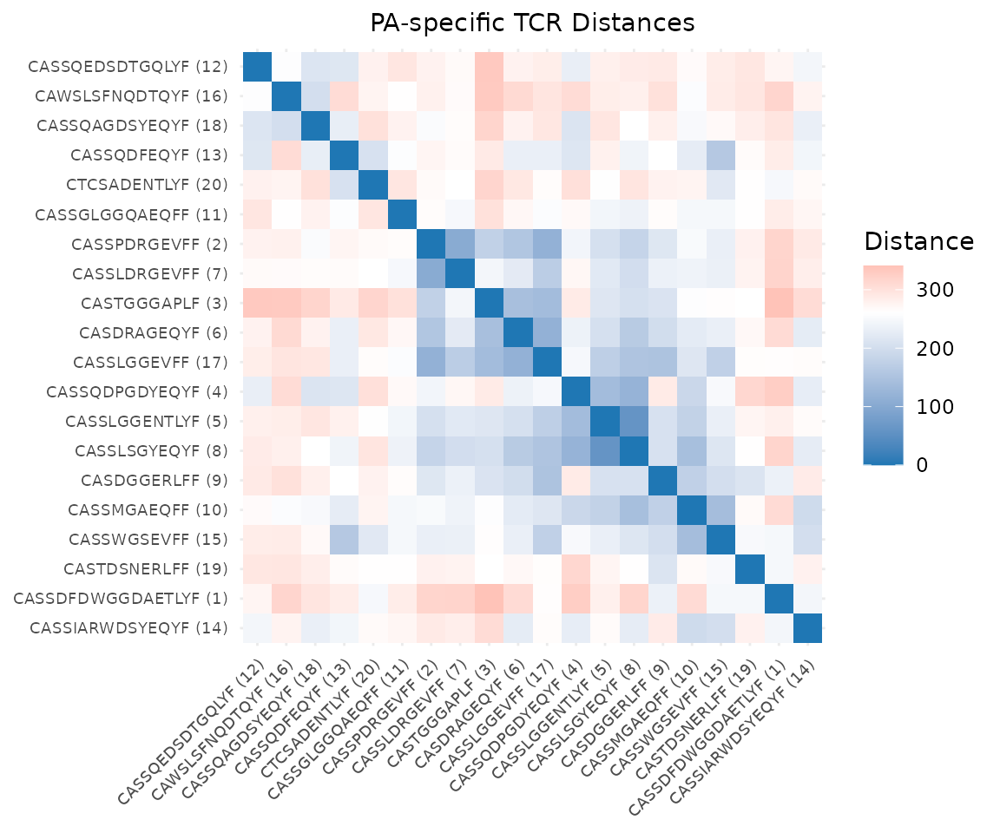

## Dendrogram

Plot a hierarchical clustering dendrogram. Unlike the heatmap,
[`plot_tcrdist_dendrogram()`](https://shihanli92.github.io/tcrdistR/reference/plot_tcrdist_dendrogram.md)
takes a TCR data.frame and computes distances internally:

``` r
plot_tcrdist_dendrogram(pa_sub, organism = "mouse")
```

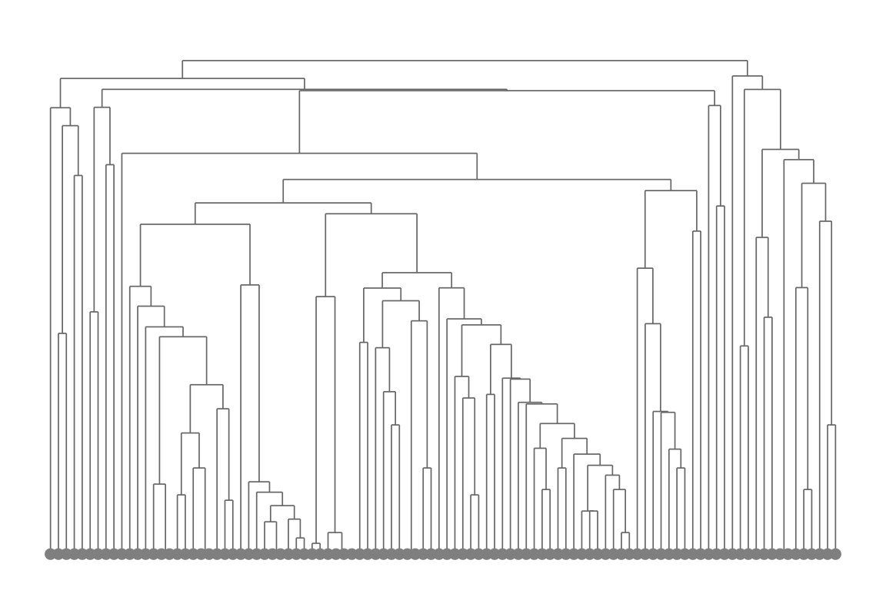

Color by a grouping variable:

``` r
# Mix epitopes for a more interesting dendrogram
mixed <- dash[dash$epitope %in% c("PA", "NP"), ]
mixed_sub <- mixed[sample(nrow(mixed), 80), ]

plot_tcrdist_dendrogram(
  mixed_sub, organism = "mouse",
  color_by = mixed_sub$epitope,
  title = "PA vs NP TCRs"
)
```

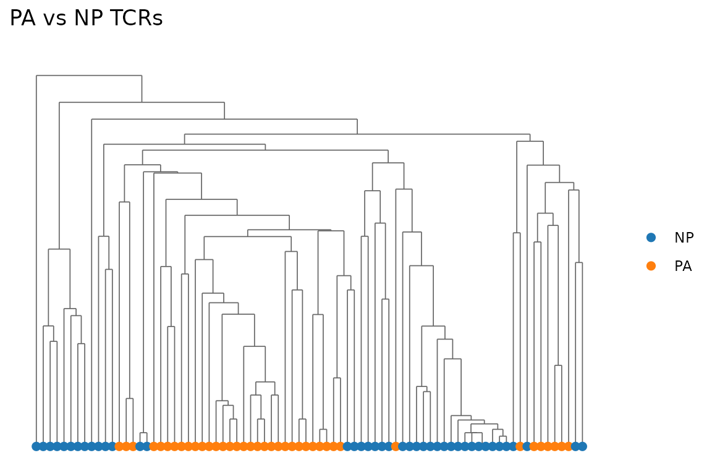

## Distance Distribution

Histogram and density of pairwise distances. Like the heatmap, this
takes a precomputed distance matrix:

``` r
plot_distance_distribution(dist_mat)
```

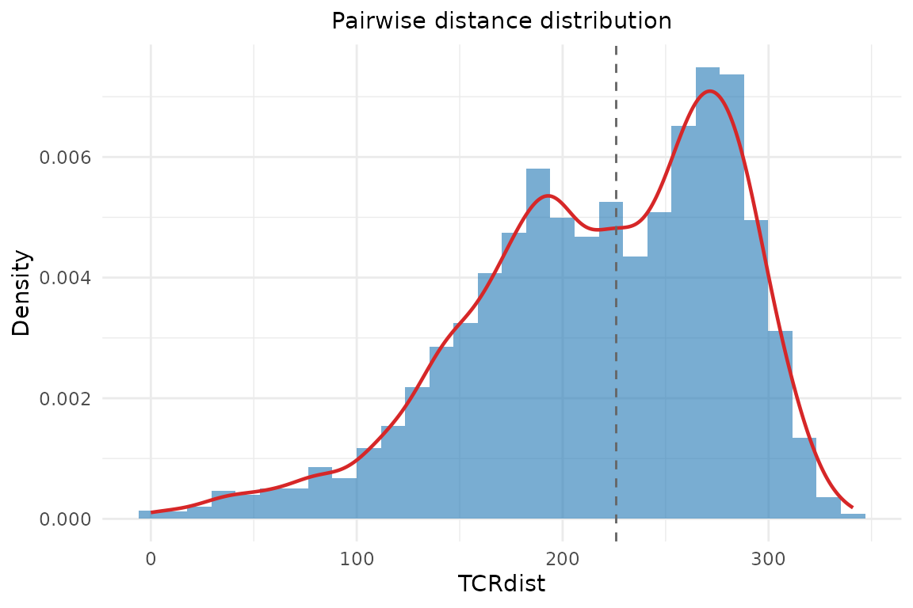

With custom bin width:

``` r
plot_distance_distribution(dist_mat, binwidth = 10,
                           title = "PA TCR distance distribution")
```

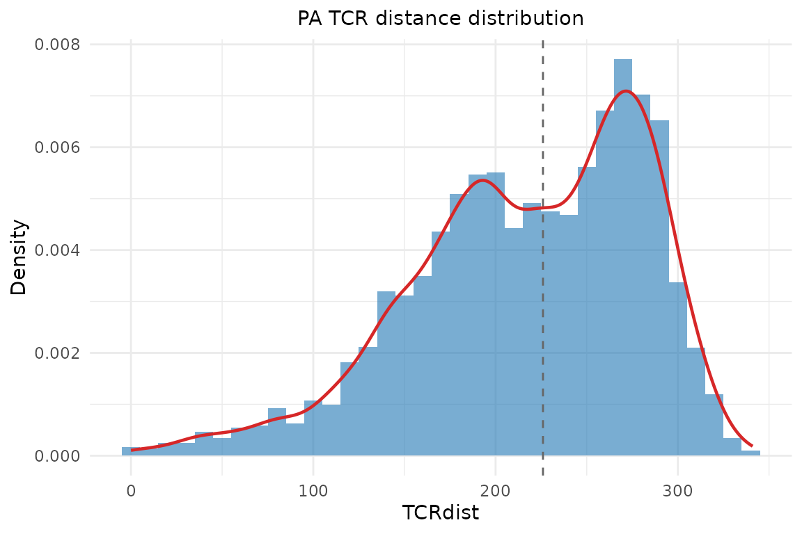

## PCA Scatter Plot

2D scatter plot from kernel PCA or any dimensionality reduction.
[`plot_tcr_scatter()`](https://shihanli92.github.io/tcrdistR/reference/plot_tcr_scatter.md)
takes a N x 2 coordinate matrix:

``` r
pca <- compute_tcrdist_kernel_pca(
  mixed_sub, organism = "mouse", n_components = 5L
)

plot_tcr_scatter(
  pca$embeddings[, 1:2],
  color_by = mixed_sub$epitope,
  title = "Kernel PCA: PA vs NP",
  point_size = 2
)
```

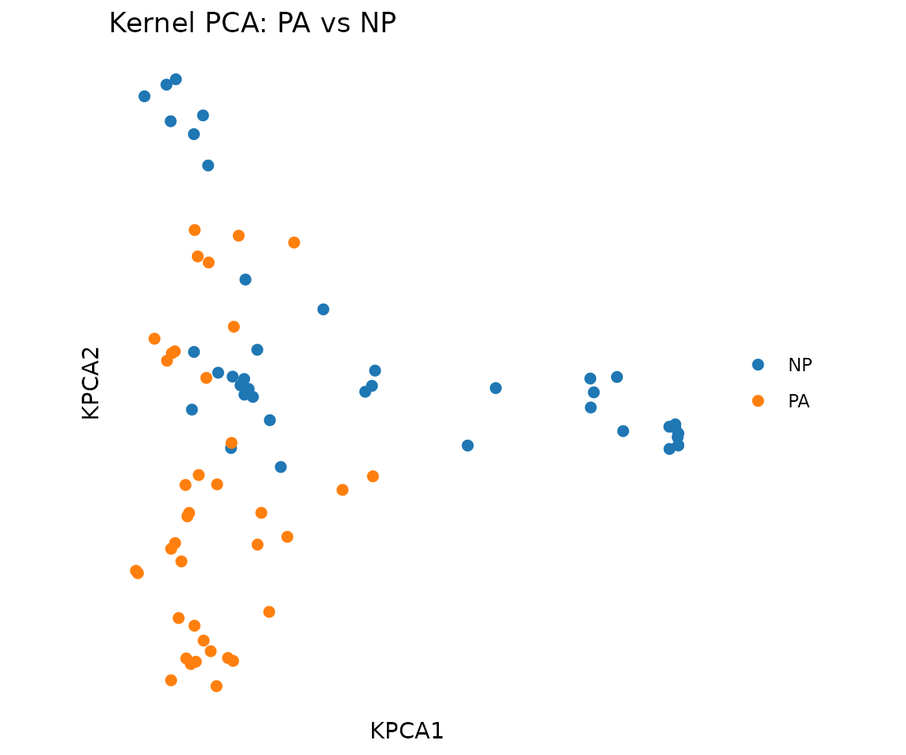

Color by a continuous variable (e.g., third principal component):

``` r
plot_tcr_scatter(
  pca$embeddings[, 1:2],
  color_by = pca$embeddings[, 3],
  title = "Colored by KPC3",
  point_size = 2,
  legend_title = "KPC3"
)
```

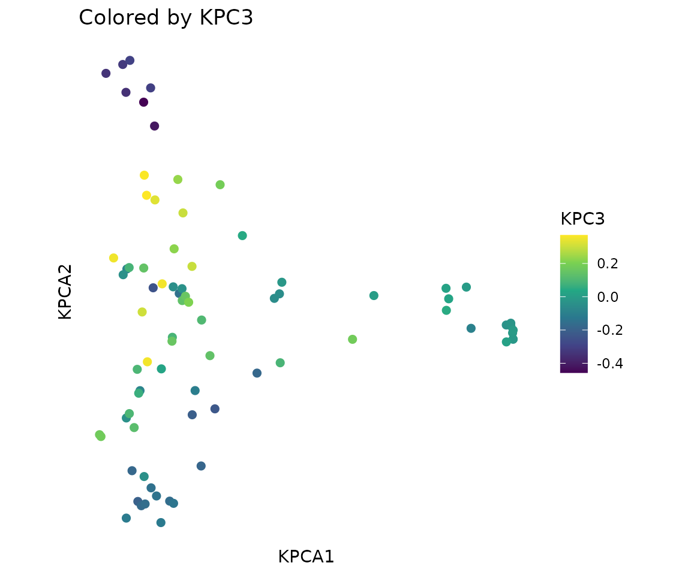

## Gene Usage

Horizontal bar chart of V-gene frequencies.
[`plot_gene_usage()`](https://shihanli92.github.io/tcrdistR/reference/plot_gene_usage.md)
takes a data.frame and a column name:

``` r
plot_gene_usage(pa, "va", title = "V-alpha usage (PA)")
```

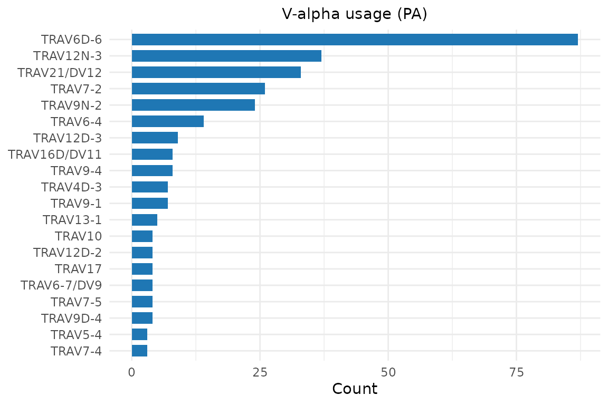

``` r
plot_gene_usage(pa, "vb", title = "V-beta usage (PA)")
```

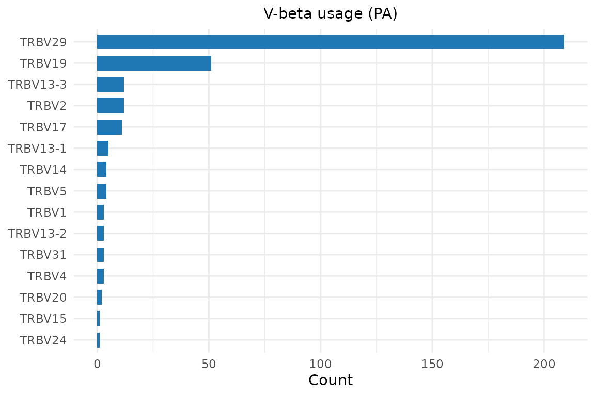

## V/J Gene Logos

[`plot_vj_gene_logo()`](https://shihanli92.github.io/tcrdistR/reference/plot_vj_gene_logo.md)
renders gene names as text glyphs whose height is proportional to
frequency — a “sequence logo” style for gene usage:

``` r
plot_vj_gene_logo(pa$vb, organism = "mouse",
                  gene_type = "V", chain = "beta")
```


``` r
plot_vj_gene_logo(pa$ja, organism = "mouse",
                  gene_type = "J", chain = "alpha")
```

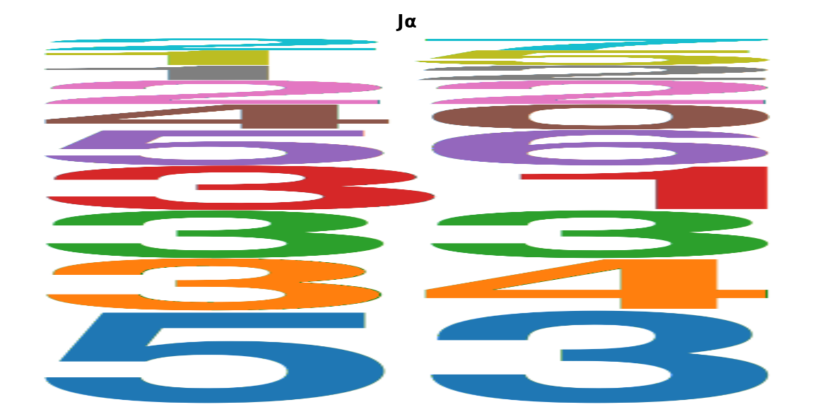

## CDR3 Sequence Logos

Display amino acid frequency at each position as a sequence logo. The
logo construction aligns sequences using BLOSUM62-optimal gap placement:

``` r
plot_cdr3_logo(pa_sub$cdr3b, chain = "beta", method = "bits",
               title = "CDR3-beta logo (PA)")
#> Warning: `aes_string()` was deprecated in ggplot2 3.0.0.
#> ℹ Please use tidy evaluation idioms with `aes()`.
#> ℹ See also `vignette("ggplot2-in-packages")` for more information.
#> ℹ The deprecated feature was likely used in the ggseqlogo package.
#>   Please report the issue at <https://github.com/omarwagih/ggseqlogo/issues>.
#> This warning is displayed once per session.
#> Call `lifecycle::last_lifecycle_warnings()` to see where this warning was
#> generated.
```

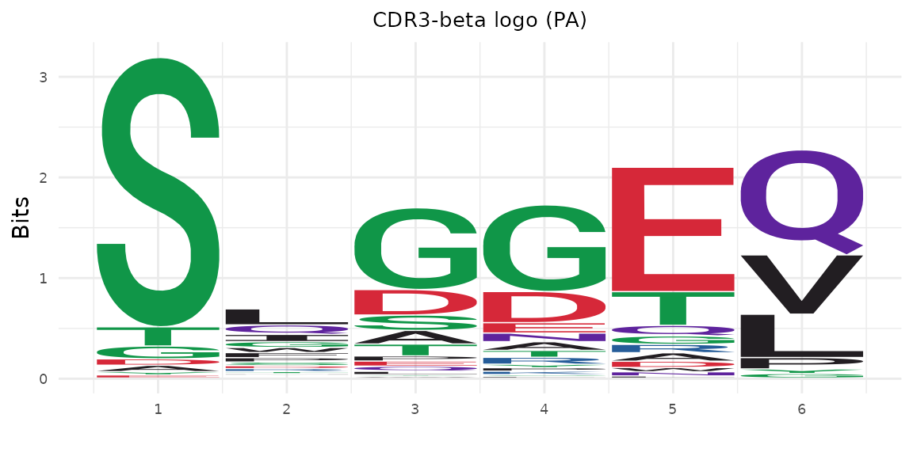

Frequency (“prob”) mode:

``` r
plot_cdr3_logo(pa_sub$cdr3a, chain = "alpha", method = "prob",
               title = "CDR3-alpha logo (PA)")
```

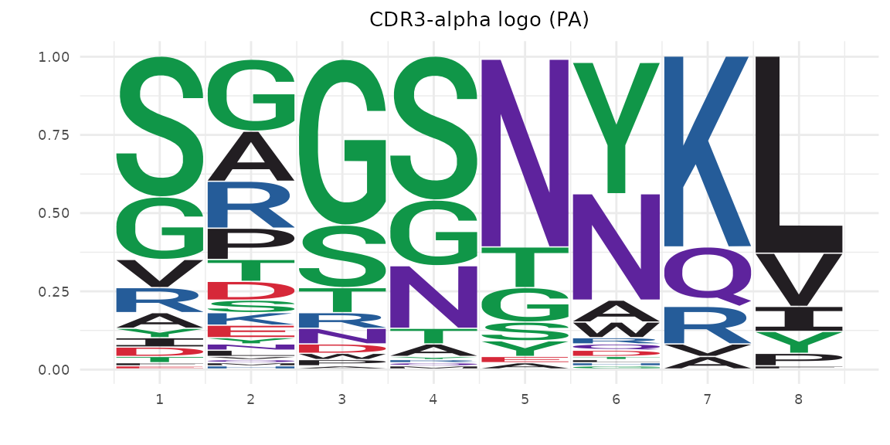

## Junction Bars

[`compute_nucseq_src()`](https://shihanli92.github.io/tcrdistR/reference/compute_nucseq_src.md)
analyzes CDR3 nucleotide sequences to identify V/N/D/J segment origins.
Pass the result to
[`plot_cdr3_logo()`](https://shihanli92.github.io/tcrdistR/reference/plot_cdr3_logo.md)
with `show_junction_bars = TRUE` to display the rearrangement structure:

``` r
src <- compute_nucseq_src(pa_sub, organism = "mouse", chain = "beta")
plot_cdr3_logo(pa_sub$cdr3b, chain = "beta",
               nucseq_src = src, show_junction_bars = TRUE,
               title = "CDR3-beta with junction bars (PA)")
#> Scale for x is already present.
#> Adding another scale for x, which will replace the existing scale.
```

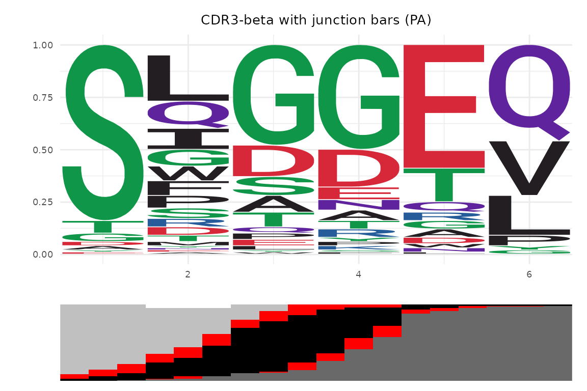

## TCR Logo Panel

[`plot_tcr_logo_panel()`](https://shihanli92.github.io/tcrdistR/reference/plot_tcr_logo_panel.md)
combines V-gene logos, CDR3 sequence logos with junction bars, and
J-gene logos for both chains into a single composite panel:

``` r
plot_tcr_logo_panel(pa_sub, organism = "mouse",
                    title = "PA-specific TCR rearrangement")
#> Scale for x is already present.
#> Adding another scale for x, which will replace the existing scale.
#> Scale for x is already present.
#> Adding another scale for x, which will replace the existing scale.
```

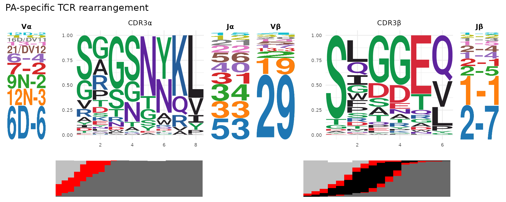

## TCR Network Plot

Visualize TCR similarity as a network graph. Nodes are TCRs, edges
connect TCRs within a distance threshold. Requires the igraph package.

``` r
# Build network with auto-detected threshold
net <- compute_tcr_network(pa_sub, organism = "mouse")
#> Auto-detected distance threshold: 216.7
```

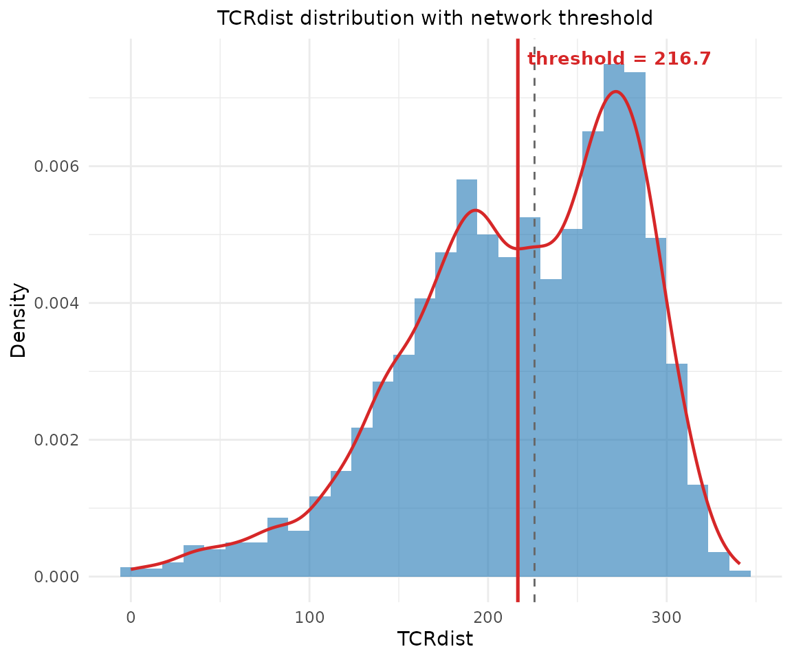

``` r

# Color by a vertex attribute (stored from the input data.frame)
plot_tcr_network(net, color_by = "subject",
                 vertex_size = 3, title = "PA TCR Network")
```

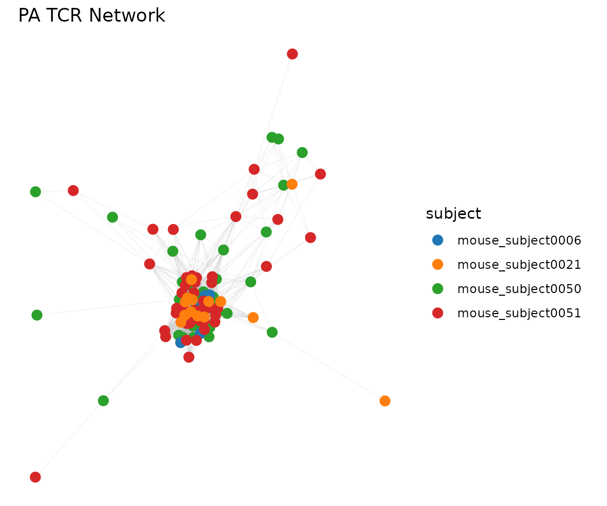

Control the threshold and prune isolated nodes:

``` r
net2 <- compute_tcr_network(pa_sub, organism = "mouse",
                            threshold = 48, min_edges = 2)
```

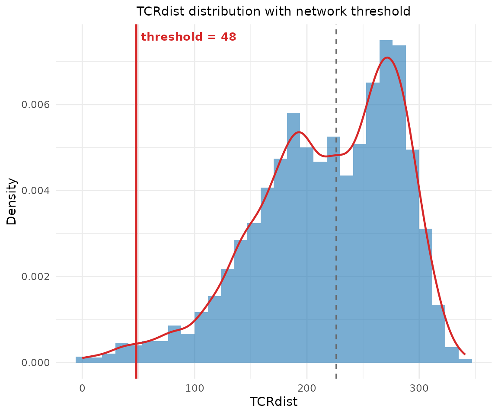

``` r
plot_tcr_network(net2, vertex_size = 3,
                 title = "Threshold=48, min_edges=2")
```

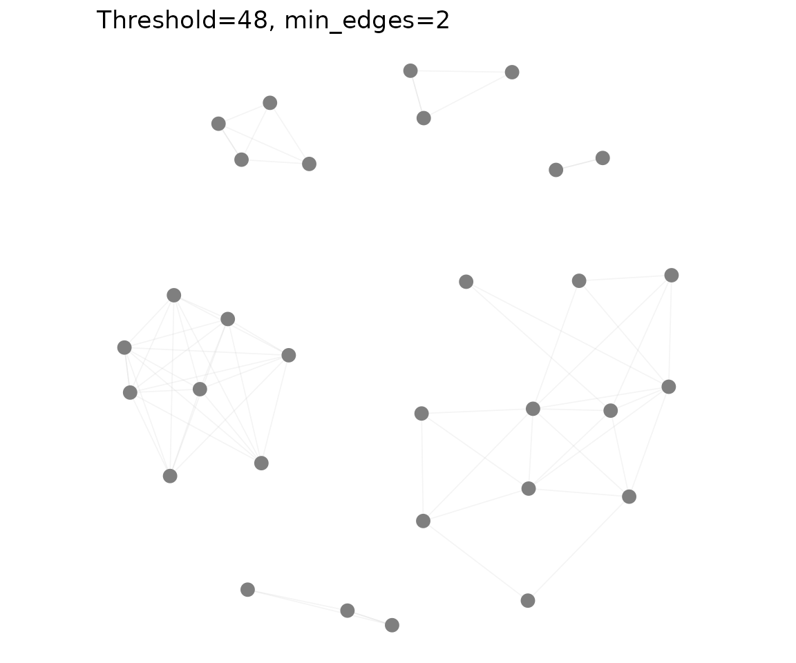

## Combining Plots

Use the patchwork package to arrange multiple plots:

``` r
library(patchwork)

p1 <- plot_tcrdist_heatmap(dist_mat[1:30, 1:30], title = "Heatmap")
p2 <- plot_distance_distribution(dist_mat, title = "Distribution")
p3 <- plot_gene_usage(pa, "va", title = "V-alpha")
p4 <- plot_gene_usage(pa, "vb", title = "V-beta")

(p1 | p2) / (p3 | p4) +
  plot_annotation(title = "PA Repertoire Overview")
```

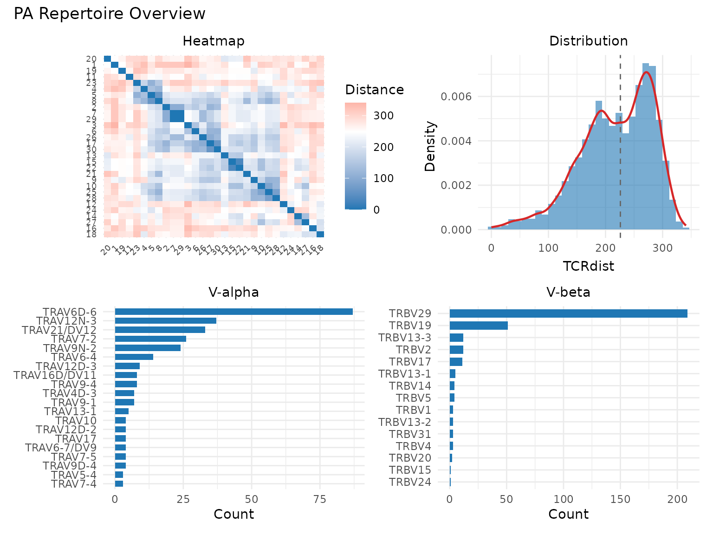

## Saving Publication-Quality Figures

All tcrdistR plot functions return ggplot objects, so you can use
[`ggplot2::ggsave()`](https://ggplot2.tidyverse.org/reference/ggsave.html)
to export high-resolution figures:

``` r
library(ggplot2)

p <- plot_tcr_scatter(
  pca$embeddings[, 1:2],
  color_by = mixed_sub$epitope,
  title = "Kernel PCA",
  point_size = 2
)

# PDF (vector format, best for journals)
ggsave("figure1.pdf", p, width = 6, height = 5)

# PNG (raster, good for presentations)
ggsave("figure1.png", p, width = 6, height = 5, dpi = 300)

# Customize theme for publication
p + theme(
  text = element_text(size = 14),
  plot.title = element_text(size = 16, face = "bold"),
  legend.position = "bottom"
)
```

## Session Info

``` r
sessionInfo()
#> R version 4.6.1 (2026-06-24)
#> Platform: x86_64-pc-linux-gnu
#> Running under: Ubuntu 24.04.4 LTS
#> 
#> Matrix products: default
#> BLAS:   /usr/lib/x86_64-linux-gnu/openblas-pthread/libblas.so.3 
#> LAPACK: /usr/lib/x86_64-linux-gnu/openblas-pthread/libopenblasp-r0.3.26.so;  LAPACK version 3.12.0
#> 
#> locale:
#>  [1] LC_CTYPE=C.UTF-8       LC_NUMERIC=C           LC_TIME=C.UTF-8       
#>  [4] LC_COLLATE=C.UTF-8     LC_MONETARY=C.UTF-8    LC_MESSAGES=C.UTF-8   
#>  [7] LC_PAPER=C.UTF-8       LC_NAME=C              LC_ADDRESS=C          
#> [10] LC_TELEPHONE=C         LC_MEASUREMENT=C.UTF-8 LC_IDENTIFICATION=C   
#> 
#> time zone: UTC
#> tzcode source: system (glibc)
#> 
#> attached base packages:
#> [1] stats     graphics  grDevices utils     datasets  methods   base     
#> 
#> other attached packages:
#> [1] patchwork_1.3.2 ggplot2_4.0.3   tcrdistR_0.1.0 
#> 
#> loaded via a namespace (and not attached):
#>  [1] Matrix_1.7-5       gtable_0.3.6       jsonlite_2.0.0     compiler_4.6.1    
#>  [5] Rcpp_1.1.2         jquerylib_0.1.4    systemfonts_1.3.2  scales_1.4.0      
#>  [9] textshaping_1.0.5  png_0.1-9          yaml_2.3.12        fastmap_1.2.0     
#> [13] lattice_0.22-9     R6_2.6.1           labeling_0.4.3     igraph_2.3.3      
#> [17] knitr_1.51         desc_1.4.3         pillar_1.11.1      bslib_0.12.0      
#> [21] RColorBrewer_1.1-3 rlang_1.3.0        cachem_1.1.0       xfun_0.60         
#> [25] fs_2.1.0           sass_0.4.10        S7_0.2.2           otel_0.2.0        
#> [29] viridisLite_0.4.3  cli_3.6.6          magrittr_2.0.5     pkgdown_2.2.1     
#> [33] withr_3.0.3        digest_0.6.39      grid_4.6.1         lifecycle_1.0.5   
#> [37] vctrs_0.7.3        RSpectra_0.16-2    evaluate_1.0.5     glue_1.8.1        
#> [41] farver_2.1.2       ragg_1.5.2         ggseqlogo_0.2.2    rmarkdown_2.31    
#> [45] pkgconfig_2.0.3    tools_4.6.1        htmltools_0.5.9
```
